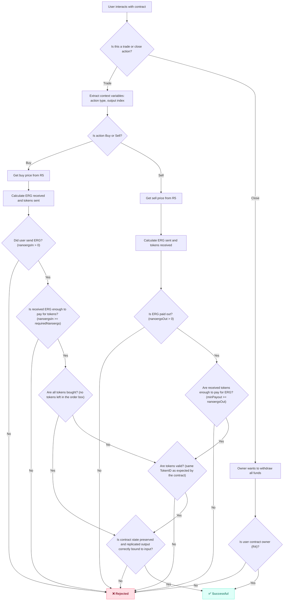

# Auto-Compounding Two-Way Grid Order Contract (ERG & TOKEN)

## Overview

This is an auto-compounding two-way grid order contract for ERG and TOKEN. The contract allows users to create grid orders for simultaneously buying and selling tokens at predefined prices.

## Key Features

- **Two-way trading:** Simultaneous buy and sell orders at grid-defined prices.
- **Auto-compounding:** All available ERG and TOKEN balances are traded for optimal compounding.
- **Owner withdrawal:** The owner can close the order and withdraw assets at any time.
- **Composable:** Multiple orders can be used in the same transaction.

## Registers & Context Variables

| Register         | Purpose                                                                   |
| ---------------- | ------------------------------------------------------------------------- |
| `R4: SigmaProp`  | Owner’s `SigmaProp` script (defines who can close/withdraw)               |
| `R5: Coll[Long]` | `[buy, sell]` prices in nanoergs per token unit                           |
| `R6: Coll[Byte]` | Spent `Input ID` (prevents spending multiple orders with a single output) |

| Context Variable | Purpose                              |
| ---------------- | ------------------------------------ |
| `0: Boolean`     | Action: `true` = Buy, `false` = Sell |
| `1: Int`         | Recreated output index               |

## Flowchart

The contract flow is visually described below. This flowchart summarizes the checks and logic for each action (Buy, Sell, Close).



## Contract Logic

- **Trading:**

  - Extract context variables to determine action and output.
  - For **Buy**:
    - Validate ERG sent is enough for requested tokens at predefined buy price.
    - Ensure contract state and token IDs are preserved.
  - For **Sell**:
    - Validate tokens sent are enough for ERG received at predefined sell price.
    - Ensure contract state and token IDs are preserved.

- **Close Order:**
  - Only the owner (as set in `R4`) can close the order and withdraw assets.

## Unit Tests
Contract unit tests are located in the [../tests/e2t-grid-order.spec.ts](/src/contracts/tests/e2t-grid-order.spec.ts) file and ensure the correctness of the actions and checks.

### Running Tests

```bash
# install dependencies
bun install

# run contract unit tests
bun test:unit e2t-grid-order
```

## Security Considerations

- The contract ensures that outputs are bound to parent inputs to prevent **input aggregation attacks**.
- Only the specified owner script can close the order and withdraw funds.

---

_For auditing, see the flowchart and inline comments in the contract code for detailed validation and safety checks._
